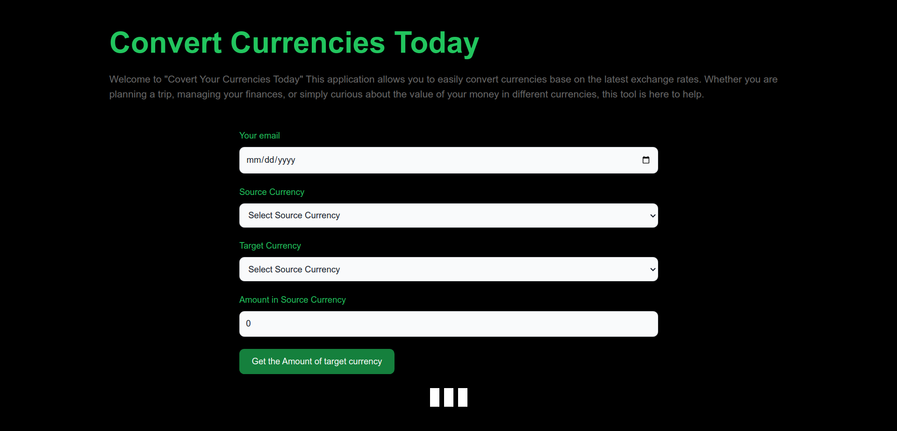
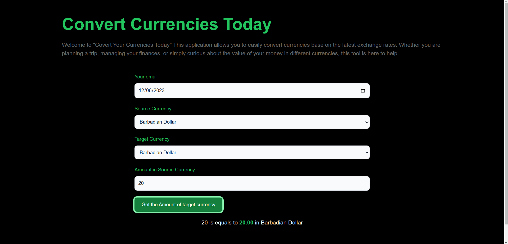

# 🖹 Historical and Today Currency Converter
## Welcome to Historical and Today Currency Converter - Web App Tool Project !

### ☛ Version
v 1.0.0

### ☛ Languages Used
1. Html, CSS, JavaScript

### ☛ Technology Used
1. Front End - ReactJS
2. Back - End - NodeJS
3. Styles - TailWindCSS

### ☛ Features
1. Currency Conversion:
Easily convert currency rates or amounts from one currency to another effortlessly. Our application provides a seamless and intuitive interface for hassle-free currency conversions.

2. Historical Conversion:
Perform conversions for any selected date starting from January 1, 2000. This feature allows you to track and analyze historical currency rates and amounts, providing valuable insights into currency trends over time.

### ☛ Images




### ☛ Resources
Below website is used to fetched historical and current data to the server.
https://openexchangerates.org/


### ☛ IDE (Integrated Development Environment)
IntelliJ IDEA Ultimate Edition

### ☛ Installation

1. Clone the repository:

   ```bash
   https://github.com/randeera/Historical-and-Today-Currency-Converter.git

2. Go to inside the client directory:

   ```bash
   cd client

3. install Dependencies:

   ```bash
   npm install

4. Run the app:

   ```bash
   npm run dev

5. Open a separate terminal:

6. Go to inside the server directory:

   ```bash
   cd server

7. Install Dependencies 
   ```bash
   npm install

8. run the project
   ```bash
   npm start

Access the Application:
After starting the application, you can access it through your web browser or any other specified means. By default, a Node.js application might run on http://localhost:5050 or a different port specified in the project.

Open your browser and navigate to the appropriate URL.

### ☛ Contact Me

- Email-  mailto:khkrandeera@gmail.com
- Linkedin-https://www.linkedin.com/in/randeera/

### ☛ Follow Me

- GitHub-https://github.com/randeera
- Linkedin-https://www.linkedin.com/in/randeera/

### ☛ License
This application is licensed under this <a href="#">License</a>

Copyright © 2023 | Kaveendra Randeera | All Rights Reserved.
